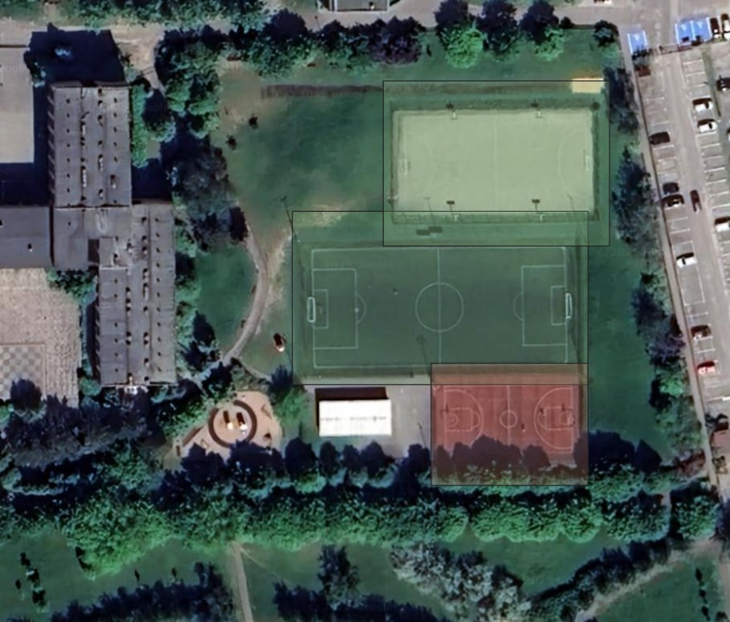
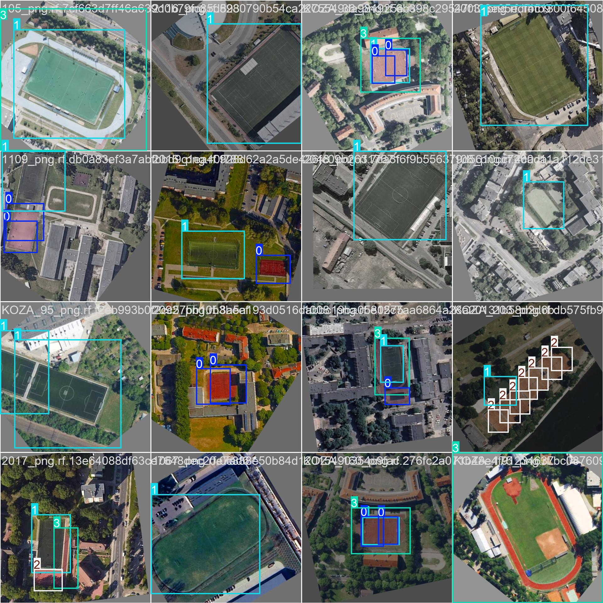
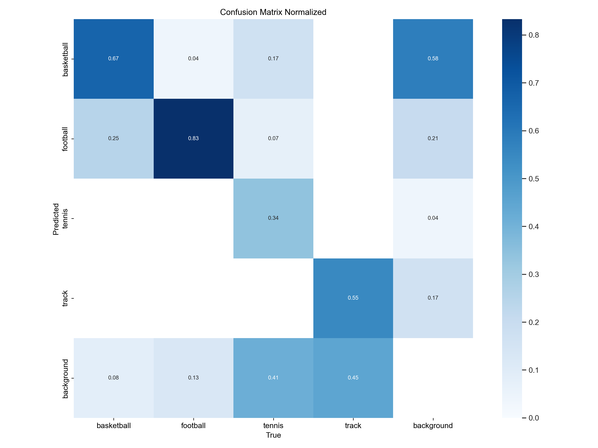
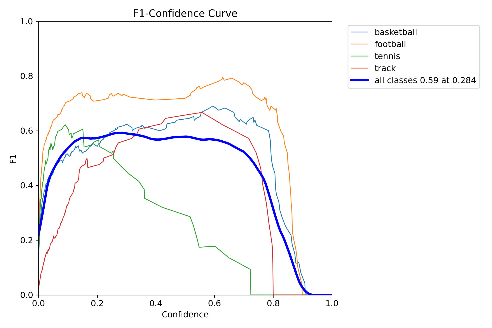

# ZPO Project - Your Deepness Model


## Dataset
Model w pierwszej kolejności był trenowany na zbiorze danych [DOTA](https://captain-whu.github.io/DOTA/index.html), którego wymiar został zredukowany do 4 klas: "['basketball', 'football', 'tennis', 'track']". Zawiera on 476 zdjęć w zbiorze "train" i 85 zdjęć w zbiorze "valid". 
Następnie model był uczony danymi pozyskanymi przez nas. Nasz dataset zawiera on 496 zdjęć w zbiorze "train" i 80 zdjęć w zbiorze "valid". Zestaw danych zawierał 1169 adnotacji na zdjęciach. Ilości obiektów dla każdej klasy:

```
{
  "football": 464,
  "basketball": 275,
  "tennis": 269,
  "track": 161
}
```

 Jest on dostępny pod [linkiem](https://universe.roboflow.com/krzy3chu/sport-fields-pphlq/dataset/6). Wszystkie znaczniki (bounding boxy) zostały wykonane ręcznie z wykorzystaniem interface'u roboflow. Zdjęcia są przechowywane w formacje ".jpg", a adnotacje w pliku ".txt". Dane do modelu były wczytywane z wykorzystaniem pliku "data.yaml" o następującej strukturze:

```
{
train: ../train/images
val: ../valid/images
test: ../test/images

nc: 4
names: ['basketball', 'football', 'tennis', 'track']

roboflow:
  workspace: krzy3chu
  project: sport-fields-pphlq
  version: 6
  license: MIT
  url: https://universe.roboflow.com/krzy3chu/sport-fields-pphlq/dataset/6
}
```
### Przykładowy obrazy z dataset'u wraz z adnotacjami


## Training
Model, który został wykorzystany do tego projektu to YOLO11m pretrenowany na zbiorze COCO. Szczegółowe parametry uczenia modelu są opisane w pliku "hyper.yaml". Do stosowania augmentacji wykorzystaliśmy "RandAugment" z biblioteki ultralytics, która dokonuje następujących transformacji:
-Przesunięcia: translacje w poziomie i pionie.
-Rotacje: obrót obrazu o losowy kąt.
-Zmiana jasności i kontrastu.
-Skalowanie: powiększanie lub pomniejszanie obrazu.
-Shear: przekształcenia skośne obrazu.
-Zmiana nasycenia, odcienia, barw i balansu kolorów.
Model był uczony bez tworzenia przez nas skryptu, zamiast tego wykorzystaliśmy biblitekę ultralytics, która umożliwiła naukę modelu z wykorzystaniem CLI: `yolo train cfg=hyper.yaml`
Wykorzystana wersja pythona: Python 3.11.9.
Wykorzystane biblioteki i ich wersje są w pliku requirements.txt.


## Results
### Przykłady poprawnej detekcji boisk


### Przykłady niepoprawnej detekcji boisk


### Znormalizowana macierz pomyłek dla zbioru walidacyjnego


### Krzywa ufności F1



## Trained model in ONNX ready for `Deepness` plugin
- model uploaded to XXX and a LINK_HERE
- model have to be in the ONNX format, including metadata required by `Deepness` plugin (spatial resolution, thresholds, ...)
- name of the script used to convert the model to ONNX and add the metadata to it

## Demo instructions and video
- a short video of running the model in Deepness (no need for audio), preferably converted to GIF
- what ortophoto to load in QGIS and what physical place to zoom-in. E.g. Poznan 2022 zoomed-in at PUT campus
- showing the results of running the model

## People
- who worked on the project

## Other information
Feel free to add other information here.