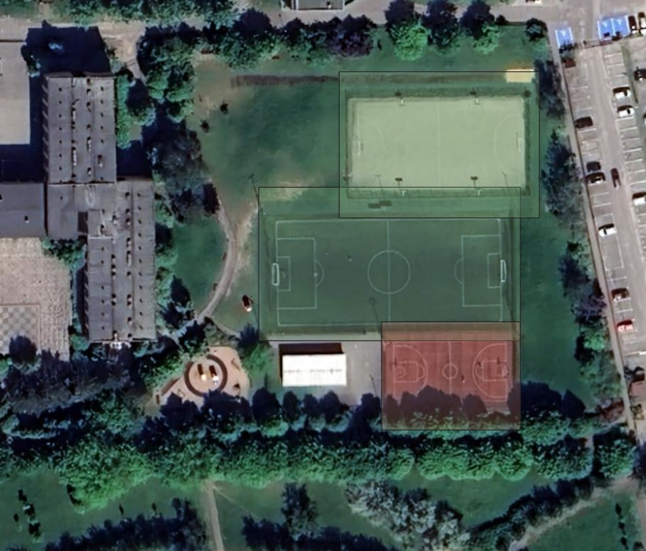

# ZPO Project - Your Deepness Model

## Dataset
Model w pierwszej kolejności był trenowany na zbiorze danych [DOTA](https://captain-whu.github.io/DOTA/index.html), którego wymiar został zredukowany do 4 klas: "['basketball', 'football', 'tennis', 'track']". Zawiera on 476 zdjęć w zbiorze "train" i 85 zdjęć w zbiorze "valid". 
Następnie model był uczony danymi pozyskanymi przez nas. Nasz dataset zawiera on 496 zdjęć w zbiorze "train" i 80 zdjęć w zbiorze "valid". Jest on dostępny pod [linkiem](https://universe.roboflow.com/krzy3chu/sport-fields-pphlq/dataset/6). Wszystkie znaczniki (bounding boxy) zostały wykonane ręcznie z wykorzystaniem interface'u roboflow. Zdjęcia są przechowywane w formacje ".jpg", a adnotacje w pliku ".txt". Dane do modelu były wczytywane z wykorzystaniem pliku "data.yaml" o następującej strukturze:
`
train: ../train/images
val: ../valid/images
test: ../test/images

nc: 4
names: ['basketball', 'football', 'tennis', 'track']

roboflow:
  workspace: krzy3chu
  project: sport-fields-pphlq
  version: 6
  license: MIT
  url: https://universe.roboflow.com/krzy3chu/sport-fields-pphlq/dataset/6
  `

- on what data trained
- how many annotations
- how the data was prepared (e.g. preprocessed)
- store the dataset with annotations in XXX and provide a link here
- what format for data and how to load it

## Training
- what network, how trained, what parameters
- what augmentation methods used
- what script to run the training
- remember to have a fully specified Python environemnt (Python version, requirements list with versions)
- other instructions to reproduce the training process

## Results
- Example images from dataset (diverse), at least 4 images
- Examples of good and bad predictions, at least 4 images
- Metrics on the test and train dataset

## Trained model in ONNX ready for `Deepness` plugin
- model uploaded to XXX and a LINK_HERE
- model have to be in the ONNX format, including metadata required by `Deepness` plugin (spatial resolution, thresholds, ...)
- name of the script used to convert the model to ONNX and add the metadata to it

## Demo instructions and video
- a short video of running the model in Deepness (no need for audio), preferably converted to GIF
- what ortophoto to load in QGIS and what physical place to zoom-in. E.g. Poznan 2022 zoomed-in at PUT campus
- showing the results of running the model

## People
- who worked on the project

## Other information
Feel free to add other information here.