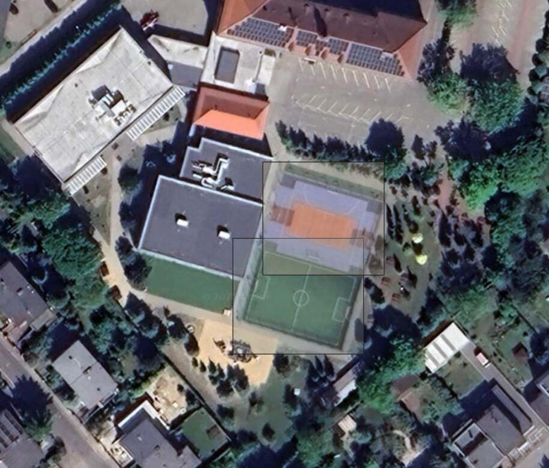
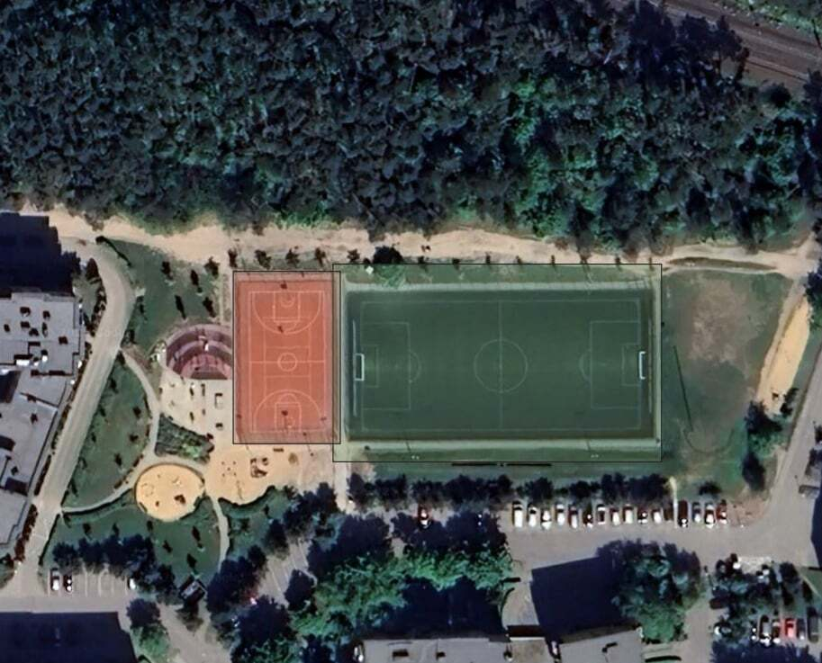
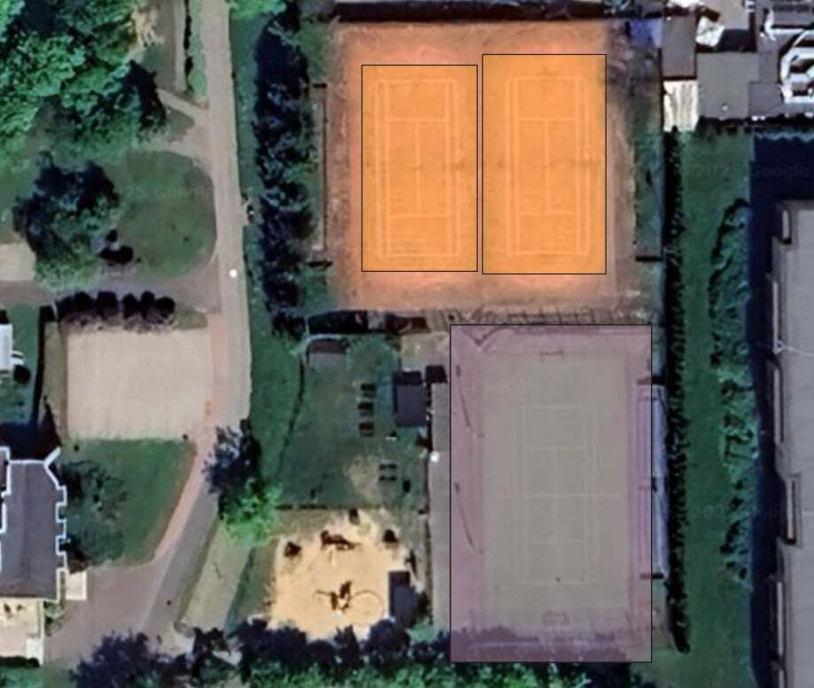
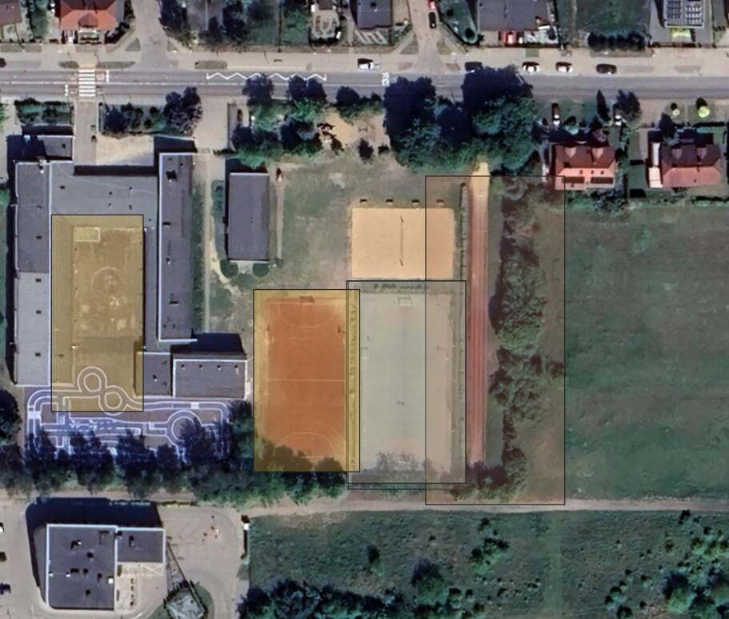
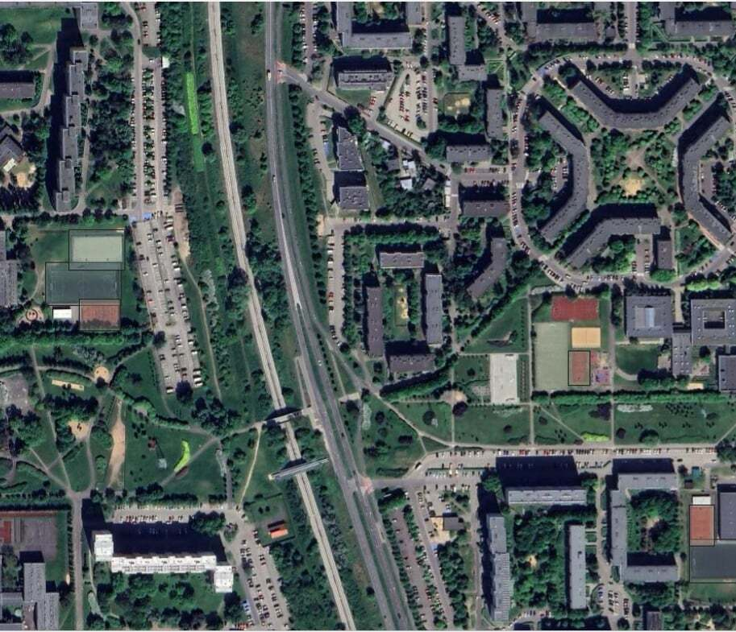
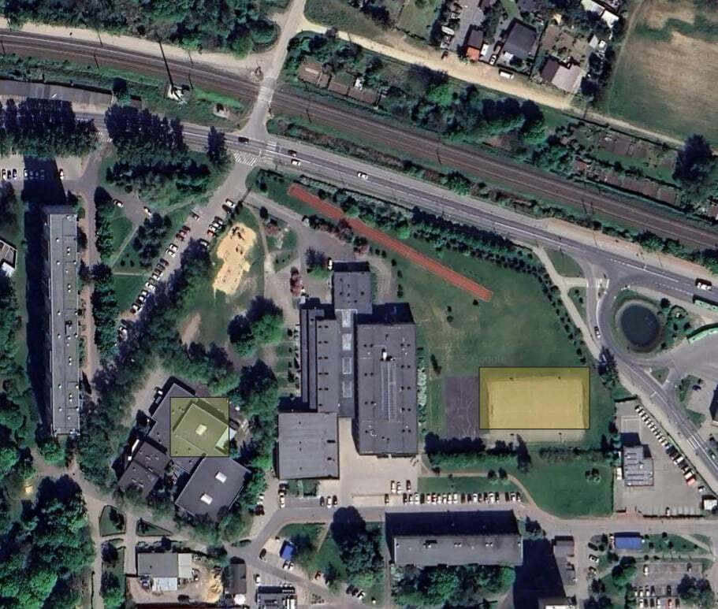

# ZPO Project - Your Deepness Model


## Dataset
Model w pierwszej kolejności był trenowany na zbiorze danych [DOTA](https://captain-whu.github.io/DOTA/index.html), którego wymiar został zredukowany do 4 klas: "['basketball', 'football', 'tennis', 'track']". Zawiera on 476 zdjęć w zbiorze "train" i 85 zdjęć w zbiorze "valid". 
Następnie model był uczony danymi pozyskanymi przez nas. Nasz dataset zawiera 496 zdjęć w zbiorze "train" i 80 zdjęć w zbiorze "valid". Zestaw danych zawierał 1169 adnotacji na zdjęciach. Ilości obiektów dla każdej klasy:

```
{
  "football": 464,
  "basketball": 275,
  "tennis": 269,
  "track": 161
}
```

 Jest on dostępny pod [linkiem](https://universe.roboflow.com/krzy3chu/sport-fields-pphlq/dataset/6). Wszystkie znaczniki (bounding boxy) zostały wykonane ręcznie z wykorzystaniem interface'u roboflow. Zdjęcia są przechowywane w formacje ".jpg", a adnotacje w pliku ".txt". Rozmar każdego zdjęcia to 512x512. Zostały one wykonane dla mapy "Bing Aerial 1" i "Google Satelite". Rozdzielczość dla każego zdjęcia to 60mm/px w skali 1:1250. Dane do modelu były wczytywane z wykorzystaniem pliku "data.yaml" o następującej strukturze:

```
{
train: ../train/images
val: ../valid/images
test: ../test/images

nc: 4
names: ['basketball', 'football', 'tennis', 'track']

roboflow:
  workspace: krzy3chu
  project: sport-fields-pphlq
  version: 6
  license: MIT
  url: https://universe.roboflow.com/krzy3chu/sport-fields-pphlq/dataset/6
}
```
### Przykładowy obrazy z dataset'u wraz z adnotacjami


## Training
Model, który został wykorzystany do tego projektu to YOLO11m pretrenowany na zbiorze COCO. Szczegółowe parametry uczenia modelu są opisane w pliku "hyper.yaml". Do stosowania augmentacji wykorzystaliśmy "RandAugment" z biblioteki ultralytics, która dokonuje następujących transformacji:
- Przesunięcia: translacje w poziomie i pionie.
- Rotacje: obrót obrazu o losowy kąt.
- Zmiana jasności i kontrastu.
- Skalowanie: powiększanie lub pomniejszanie obrazu.
- Shear: przekształcenia skośne obrazu.
- Zmiana nasycenia, odcienia, barw i balansu kolorów.

Model był uczony bez tworzenia przez nas skryptu, zamiast tego wykorzystaliśmy biblitekę ultralytics, która umożliwiła naukę modelu z wykorzystaniem CLI: `yolo train cfg=hyper.yaml`
Wykorzystana wersja pythona: Python 3.11.9.
Wykorzystane biblioteki i ich wersje są w pliku requirements.txt.


## Results
### Przykłady poprawnej detekcji boisk





### Przykłady niepoprawnej detekcji boisk





### Znormalizowana macierz pomyłek dla zbioru walidacyjnego


### Krzywa ufności F1


## Trained model in ONNX ready for `Deepness` plugin
Gotowy model do wykorzystania w Deepness jest dostępny w tym repozytorium pod nazwą "pl_best_m.onnx"
Do wyeksportowania modelu do formatu ONNX wykorzystaliśmy komendę `export` z biblioteki ultralytics i wykonaliśmy ją w CLI.
```
{
yolo export model=pl_best_m.pt format=onnx  # creates 'pl_best_m.onnx'
}
```

## People
- Krzysztof Grot
- Aleksy Józefowski
